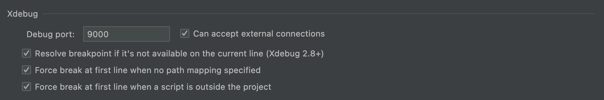
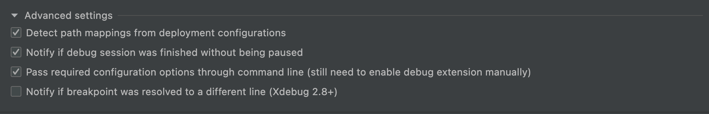
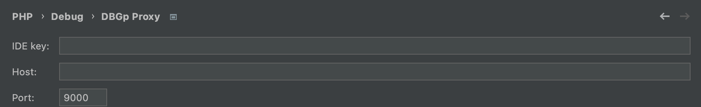

# Configuring IDE

## Debug settings

Go to "**Settings**" - "**Preferences**" - "**PHP**" - "**Debug**"

Setup **xDebug**:



Setup **Advanced settings**



Go to "**Settings**" - "**Preferences**" - "**PHP**" - "**Debug**" - "**DBGp Proxy**"&#x20;



## Setup Deployment

1. Enable "**Tools**" - "**Deployment**" - "**Automatic Upload**"
2. Go to "**Tools**" - "**Deployment**" - "**Configuration...**"
3. Run "**Tools**" - "**Deployment**" - "**Browse Remote Hosts**" to open the panel "**Remote Host**"
4. Add new SFTP connection&#x20;
5. Setup mappings&#x20;

#### Main catalogs MikoPBX

* **`/usr/www`**` ``` - [Core](https://github.com/mikopbx/Core) files
* **`/storage/usbdisk1/mikopbx/custom_modules`** - directory for storing modules
* **`/storage/usbdisk1/mikopbx/custom_modules/ModulePhoneBook`** the [**PhoneBook**](https://github.com/mikopbx/ModulePhoneBook) module will be stored in this directory&#x20;

#### Example of mapping settings:

Let's say a local directory with Core: **`/Users/alexeyportnov/project/pbx_miko/!Core`**

Local directory with modules: **`/Users/alexeyportnov/project/pbx_miko/modules`**, &#x20;

Then the mapping settings will be as follows:


