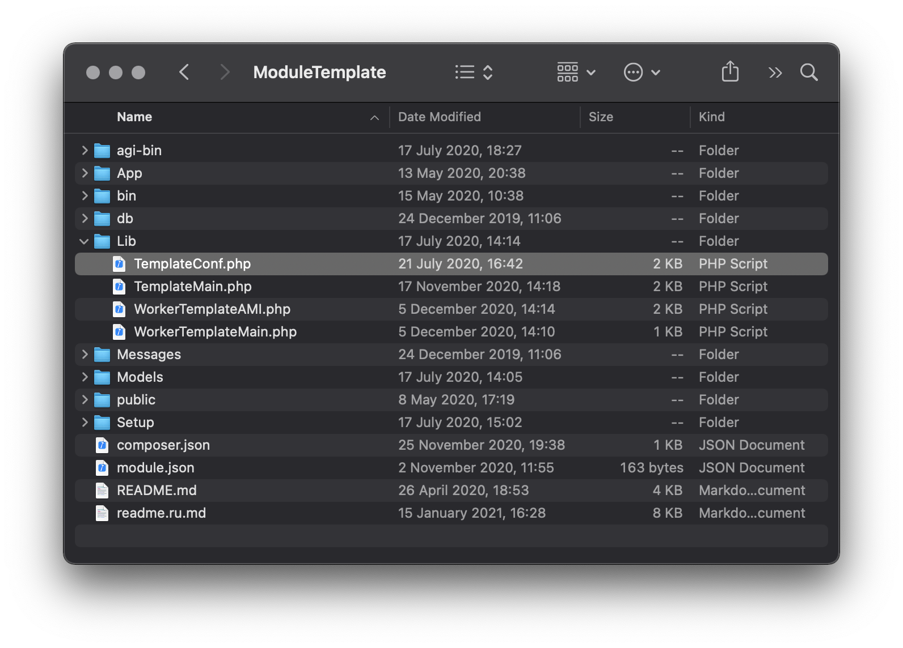

# Module main class

On the template repository, you can find an example in the file ModuleTemplate/Lib/**TemplateConf.php**  
You can use it for your project according to your preferences. The name of this class should be consist of a module unique identifier and ends with the **Conf** word.

Good examples:

* MyFirstModuleConf
* MikoCallTrackingConf
* TheBestModuleConf

Non-workable examples:

* TemplateConf
* MyFirstModuleConf1
* TheBestModuleConfig



After applying [the instructions](template-module-structure.md) your config class will be renamed automatically. 

## Asterisk configs generators

#### generateConfig

Generates core modules config files with cli messages before and after generation.

Example:

```php
public function generateConfig(): void;
```

### extensions.conf

#### extensionGlobals

Prepares additional parameters for \[globals\] section in extensions.conf file

Example:

```php
public function extensionGlobals(): string;
```

#### extensionGenContexts

Prepares additional contexts sections in extensions.conf file

Example:

```php
/**
* Adds the context "miko_new_context" with the extension "10000107" 
* 
* @return string
*/
public function extensionGenContexts(): string
{
   $conf = "[miko_new_context]\n";
   $conf .= 'exten => 10000107,1,Answer()' . "\n\t";
   $conf .= '  same => n,Set(CHANNEL(hangup_handler_wipe)=hangup_handler_meetme,s,1)' . "\n\t";
   $conf .= '  same => n,AGI(cdr_connector.php,meetme_dial)' . "\n\t";
   $conf .= '  same => n,Meetme(${mikoidconf},${mikoparamconf})' . "\n\t";
   $conf .= '  same => n,Hangup()' . "\n\n";
   return $conf;
}
```

#### getIncludeInternal

Prepares additional includes for \[internal\] context section in the extensions.conf file

Example:

```php
/**
* Prepares additional includes for [internal] context section in the extensions.conf file
*
* @return string
*/
public function getIncludeInternal(): string
{
    $conf     = '';
    $settings = ModuleSmartIVR::findFirst();
    if ($settings !== null) {
        $conf = 'include => module_smartivr ' . PHP_EOL;
    }
    return $conf;
}
```

#### extensionGenInternal

Prepares additional rules for \[internal\] context section in the extensions.conf file

Example:

```php
public function extensionGenInternal(): string;
```

#### getIncludeInternalTransfer

Prepares additional includes for \[internal-transfer\] context section in the extensions.conf file

Example:

```php
public function getIncludeInternalTransfer(): string;
```

#### extensionGenInternalTransfer

Prepares additional rules for \[internal-transfer\] context section in the extensions.conf file

Example:

```php
public function extensionGenInternalTransfer(): string;
```

#### 

#### extensionGenInternalUsersPreDial

Prepares additional rules for \[internal-users\] context section in the extensions.conf file

Example:

```php
public function extensionGenInternalUsersPreDial(): string;
```

#### 

#### extensionGenHints

Prepares additional hints for \[internal-hints\] context section in the extensions.conf file

Example:

```php
public function extensionGenHints(): string;
```

#### generateIncomingRoutBeforeDial

Prepares additional parameters for each incoming context for each incoming route before dial in extensions.conf file

Example:

```php
/**
* Sends AMI UserEvent with name Interception and the next parameters:
* CALLERID(num), CHANNEL, FROM_DID on every incomming call.
*
* @param $rout_number
*
* @return string
*/
public function generateIncomingRoutBeforeDial(string $rout_number): string
{
    $conf = "\t";
    $conf = 'same => n,UserEvent(Interception,CALLERID: ${CALLERID(num)},chan: ${CHANNEL},FROM_DID: ${FROM_DID})';    
    return $conf;
}
```

#### generateIncomingRoutAfterDialContext

Prepares additional parameters for each incoming context \* and incoming route after dial command in an extensions.conf file

Example:

```php
public function generateIncomingRoutAfterDialContext(string $uniqId): string;
```

#### generatePublicContext

Prepares additional parameters for \[public-direct-dial\] section in the extensions.conf file

Example:

```php
public function generatePublicContext(): string;
```

#### generateOutRoutContext

Prepares additional parameters for each outgoing route context before dial call in the extensions.conf file

Example:

```php
/**
* Prepares additional parameters for each outgoing route context 
* before dial call in the extensions.conf file
*
* @param $rout
*
* @return string
*/
public function generateOutRoutContext($rout): string
{
   $conf = "\t".'same => n,ExecIf($["x${FROM_PEER}" == "x" && "${CHANNEL(channeltype)}" == "PJSIP" ]?Gosub(set_from_peer,s,1))' . " \n\t";
   $conf .= 'same => n,Set(GR_VARS=${DB(UsersGroups/${FROM_PEER})})' . " \n\t";
   $conf .= 'same => n,ExecIf($["${GR_VARS}x" != "x"]?Exec(Set(${GR_VARS})))' . " \n\t";
   $conf .= 'same => n,ExecIf($["${GR_PERM_ENABLE}" == "1" && "${GR_ID_' . $rout['id'] . '}" != "1"]?return)' . " \n\t";
   $conf .= 'same => n,ExecIf($["${GR_PERM_ENABLE}" == "1" && "${GR_CID_' . $rout['id'] . '}x" != "x"]?MSet(GR_OLD_CALLERID=${CALLERID(num)},OUTGOING_CID=${GR_CID_' . $rout['id'] . '}))';

   return $conf;
}
```

#### generateOutRoutAfterDialContext

Prepares additional parameters for each outgoing route context after dial call in the extensions.conf file

Example:

```php
/**
* Prepares additional parameters for each outgoing route context after dial action
*
* @param array $rout
*
* @return string
*/
public function generateOutRoutAfterDialContext(array $rout): string
{
  return "\t".'same => n,ExecIf($["${GR_PERM_ENABLE}" == "1" && "${GR_OLD_CALLERID}x" != "x"]?MSet(CALLERID(num)=${GR_OLD_CALLERID},GR_OLD_CALLERID=${UNDEFINED}))';
}
```

### managers.conf

#### generateManagerConf

Prepares additional AMI users data in the manager.conf file. This record is not present on the web interface.

Example:

```php
/**
* Prepares additional AMI users data in the manager.conf file
*
*
* @return string
*/
public function generateManagerConf(): string
{
   $arr_params  = [
      'Cdr',
      'Dial',
      'DialBegin',
      'DialEnd',
      'ExtensionStatus',
      'Hangup',
           
   ];
      $managerUser = self::MODULE_AMI_USER;
      $conf = "[{$managerUser}]" . PHP_EOL;
      $conf .= "secret={$managerUser}" . PHP_EOL;
      $conf .= 'deny=0.0.0.0/0.0.0.0' . PHP_EOL;
      $conf .= 'permit=127.0.0.1/255.255.255.255' . PHP_EOL;
      $conf .= 'read=agent,call,cdr,user' . PHP_EOL;
      $conf .= 'write=system,call,originate,reporting' . PHP_EOL;
      $conf .= 'eventfilter=!UserEvent: CdrConnector' . PHP_EOL;
      $conf .= 'eventfilter=Event: (' . implode('|', $arr_params) . ')' . PHP_EOL;
      $conf .= PHP_EOL;

      return $conf;
}
```


### pjsip.conf

#### generatePeersPj

Prepares additional peers data in the pjsip.conf file

Example:

```php
public function generatePeersPj(): string;
```

#### generatePeerPjAdditionalOptions

Prepares additional pjsip options on endpoint section in the pjsip.conf file for peer

Example:

```php
public function generatePeerPjAdditionalOptions(array $peer): string;
```

#### overrideProviderPJSIPOptions

Override pjsip options for provider in the pjsip.conf file

Example:

```php
/**
* Override pjsip options for provider in the pjsip.conf file
*
* @param string $uniqid  the provider unique identifier
* @param array  $options list of pjsip options
*
* @return array
*/
public function overrideProviderPJSIPOptions(string $uniqid, array $options): array
{

}
```

#### overridePJSIPOptions

Override pjsip options for peer in the pjsip.conf file

Example:

```php
/**
* Override pjsip options for peer in the pjsip.conf file
* @param string $id
* @param array $options
* @return array
*/
public function overridePJSIPOptions(string $id, array $options):array
{
    $groupID = $this->listUsers[$id]??'';
    $type    = $options['type']??'';
    if(!empty($groupID) && $type === 'endpoint'){
         $options['call_group']   = $groupID;
         $options['pickup_group'] = $groupID;
    }
    return $options;
}
```

### features.conf

#### getFeatureMap

Prepares additional parameters for \[featuremap\] section in the features.conf file

Example:

```php
public function getFeatureMap(): string;
```

### Other

```php
/**
 * Prepares settings dataset for a PBX module
 */
public function getSettings(): void;


/**
 * Returns the messages variable
 *
 * @return array
 */
public function getMessages(): array;

/**
 * Returns models list of models which affect the current module settings
 *
 * @return array
 */
public function getDependenceModels(): array;
```

## REST API Core generators

#### getPBXCoreRESTAdditionalRoutes

Returns array of additional routes for PBXCoreREST interface from module

 \[ControllerClass, ActionMethod, RequestTemplate, HttpMethod, RootUrl, NoAuth \]

Example:

```php
 public function getPBXCoreRESTAdditionalRoutes(): array
    {
        return [
            [
                GetController::class,
                'callAction',
                '/pbxcore/api/backup/{actionName}',
                'get',
                '/',
                false,
            ],
            [
                PostController::class, 
                'callAction', 
                '/pbxcore/api/backup/{actionName}', 
                'post', 
                '/', 
                false
            ],
        ];
    }
```

#### moduleRestAPICallback

Process PBXCoreREST requests under root rights

Example:

```php
/**
*  Process CoreAPI requests under root rights
*
* @param array $request
*
* @return PBXApiResult
*/
public function moduleRestAPICallback(array $request): PBXApiResult
{
  $res = new PBXApiResult();
  $res->processor = __METHOD__;
  $action = strtoupper($request['action']);

  if($action === 'CHECK'){
     $templateMain       = new PT1CCoreMain();
     $res                = $templateMain->checkModuleWorkProperly();
  } else {
     $res->success = false;
     $res->messages[] = 'API action not found in moduleRestAPICallback';
  }

 return $res;
}
```

## System generators

### System events

#### onAfterPbxStarted

The callback function will execute after PBX started

Example:

```php
public function onAfterPbxStarted(): void;
```

#### onBeforeModuleEnable

Process before enable action in web interface

Example:

```php
public function onBeforeModuleEnable(): bool;
```

#### onAfterModuleEnable

Process after enable action in web interface

Example:

```php
/**
* Process enable action
*
* @return void
*/
public function onAfterModuleEnable(): void
{
  PBX::dialplanReload();
}
```

#### onBeforeModuleDisable

Process before disable action in web interface

Example:

```php
public function onBeforeModuleDisable(): bool;
```

#### onAfterModuleDisable

Process after disable action in web interface

Example:

```php
/**
* Process after disable action in web interface
*
* @return void
*/
public function onAfterModuleDisable(): void
{
    PBX::dialplanReload();
}
```

#### modelsEventChangeData

This method calls in the WorkerModelsEvents after receive each models change

Example:

```php
/**
* Receive information about mikopbx main database changes
*
* @param $data
*/
public function modelsEventChangeData($data): void
{
   // f.e. if user changes PBXLanguage, we will restart all workers
   if (
       $data['model'] === PbxSettings::class
       && $data['recordId'] === 'PBXLanguage'
     ){
         $templateMain = new TemplateMain();
         $templateMain->startAllServices(true);
    }
}
```

#### modelsEventNeedReload

This method calls in the WorkerModelsEvents after finished process models changing

Example:

```php
public function modelsEventNeedReload(array $modified_tables): void;
```

### Core workers

#### getModuleWorkers

Returns array of workers classes for WorkerSafeScripts

Example:

```php
/**
* Returns module workers to start it at WorkerSafeScript
*
* @return array
*/
public function getModuleWorkers(): array
{
   return [
            [
                'type'   => WorkerSafeScriptsCore::CHECK_BY_BEANSTALK,
                'worker' => WorkerTelegramMenu::class,
            ],
            [
                'type'   => WorkerSafeScriptsCore::CHECK_BY_AMI,
                'worker' => WorkerTelegramNotifyAMI::class,
            ],
   ];
}
```

### Crond

#### createCronTasks

Add crond tasks

Example:

```php
/**
* Adds crond tasks
*
* @param $tasks
*/
public function createCronTasks(&$tasks): void
{
  $workerPath = $this->moduleDir.DIRECTORY_SEPARATOR.'bin'.DIRECTORY_SEPARATOR.'safeScript.php';
  $phpPath    = Util::which('php');
  $tasks[]    = "*/1 * * * * {$phpPath} -f {$workerPath} > /dev/null 2> /dev/null\n";
}
```

### Iptables

#### getDefaultFirewallRules

Returns array of additional firewall rules for module

Example:

```php
/**
* Returns array of additional firewall rules for module
*
* @return array
*/
public function getDefaultFirewallRules(): array
{
   $defaultWeb      = PbxSettings::getValueByKey('WEBPort');
   $ajamPort        = PbxSettings::getValueByKey('AJAMPort');

    return [
            'ModulePT1CCore' => [
                'rules'     => [
                     [
                        'portfrom'    => $defaultWeb,
                        'portto'      => $defaultWeb,
                        'protocol'    => 'tcp',
                        'name'        => 'PT1CHTTPPort',
                        'portFromKey' => 'WEBPort',
                        'portToKey'   => 'WEBPort',
                    ],
                    [
                        'portfrom'    => $ajamPort,
                        'portto'      => $ajamPort,
                        'protocol'    => 'tcp',
                        'name'        => 'PT1CAjamPort',
                        'portFromKey' => 'AJAMPort',
                        'portToKey'   => 'AJAMPort',
                    ],
                ],
                'action'    => 'allow',
                'shortName' => 'CTI client 1.0',
            ],
        ];
    }
```

### Fail2Ban

#### generateFail2BanJails

Generates additional fail2ban jail conf rules

Example:

```php
/**
* Generates additional fail2ban jail conf rules
*
* @return string
*/
public function generateFail2BanJails():string
{
    return "[INCLUDES]\n" .
            "before = common.conf\n" .
            "[Definition]\n" .
            "_daemon = (authpriv.warn |auth.warn )?miko_ajam\n" .
            'failregex = ^%(__prefix_line)sFrom\s+<HOST>.\s+UserAgent:\s+[a-zA-Z0-9 \s\.,/:;\+\-_\)\(\[\]]*.\s+Fail\s+auth\s+http.$' . "\n" .
            '            ^%(__prefix_line)sFrom\s+<HOST>.\s+UserAgent:\s+[a-zA-Z0-9 \s\.,/:;\+\-_\)\(\[\]]*.\s+File\s+not\s+found.$' . "\n" .
            "ignoreregex =\n";
}
```

### Nginx

#### createNginxLocations

Create additional Nginx locations from modules

Example:

```php
/**
* Create additional Nginx locations from modules
*
*/
public function createNginxLocations(): string
{
   $luaScriptPath = $this->moduleDir.'/Lib/http_get_variables.lua';
   return "location /pbxcore/api/miko_ajam/getvar {
            default_type 'text/plain';
            content_by_lua_file {$luaScriptPath};
            keepalive_timeout 0;
		     }";
}
```

