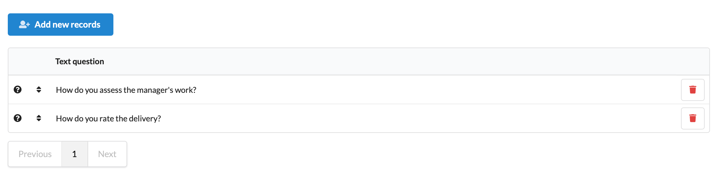

# Module interface

### Add editable table

The first step is to add a description of the table to **\*Controller.php** class:

```text
├── agi-bin
└── App
    └── Controllers
        └── ModuleTemplateController.php
```

In function "**getTablesDescription**" add a description of the table:

```php
   private function getTablesDescription():array
    {
        $description = [];
        $description['QuestionsQuality'] = [
            'cols' => [
                'rowIcon'    => ['header' => '', 'class' => 'collapsing', 'icon' => 'question circle'],
                'priority'   => ['header' => '', 'class' => 'collapsing'],
                'question'   => ['header' => 'Text question',  'class' => 'ten wide'],
                'delButton'  => ['header' => '', 'class' => 'collapsing']
            ],
            'ajaxUrl' => '/getNewRecords',
            'icon' => 'user',
            'needDelButton' => true
        ];

        return $description;
    }
```

* "**QuestionsQuality**" - name of the model class
* "**question**" - name of the property described in the model
* "**priority**" - the name of the property described in the model opens the possibility to change the order of lines in the module interface
* "**delButton**" - service field, adds the"delete" button
* "**icon**" - service field, adds an icon to the beginning of the row

Edit the **index.volt** file:

```php
├── agi-bin
└─── App
    ├── Controllers
    ├── Forms
    └── Views
        └── index.volt
```

Need add:

```php
<div class="ui grid">
    <div class="ui row">
        <div class="ui five wide column">
            {{ link_to("#", '<i class="add user icon"></i>  '~t._('module_phnbk_AddNewRecord'), "class": "ui blue button", "id":"add-new-row", "id-table":"QuestionsQuality-table") }}
        </div>
    </div>
</div>
<br>
<table id="QuestionsQuality-table" class="ui small very compact single line table"></table>
```

* Need replace "**Questions Quality**" with the name of the model class.

Go to the web interface of the module. The table will be displayed




