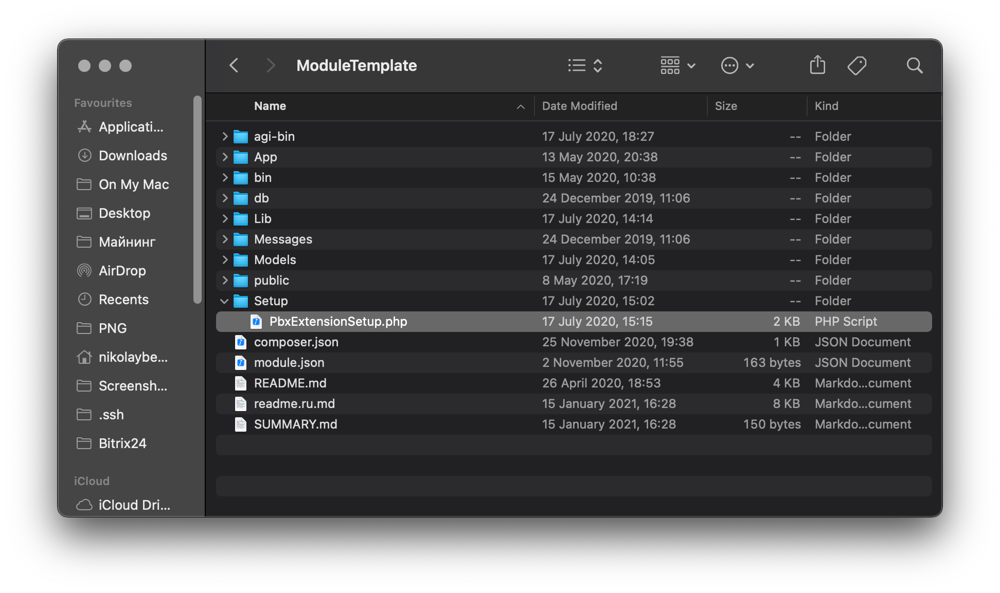

# Setup class

On the template repository, you can find an example in the file ModuleTemplate/Setup/**PbxExtensionSetup.php**  
You can use it for your project with some modifications.



  
****The [PbxExtensionSetup](https://github.com/mikopbx/ModuleTemplate/blob/master/Setup/PbxExtensionSetup.php) class should inherit [PbxExtensionSetupBase](https://github.com/mikopbx/Core/blob/master/src/Modules/Setup/PbxExtensionSetupBase.php) and can override any public functions or methods or implement a new.

## Install a module procedure

There are two ways to install a MikoPBX module to the system:

* over a ZIP archived local file
* from the MIKO modules repository

For a development purpose,  we recommend using a ZIP archive.

When you upload any new module the MikoPBX system unzips all files and calls  the next procedure:

```php
$pbxExtensionSetupClass = "\\Modules\\{$moduleUniqueID}\\Setup\\PbxExtensionSetup";
$setup = new $pbxExtensionSetupClass($moduleUniqueID);
$setup->installModule();        
```

After initializing the **PbxExtensionSetup** class you will have a lot of useful variables from a parent class:

```php
/**
* Module unique identify from the module.json
* @var string
*/
protected string $moduleUniqueID;

/**
 * Module version from the module.json
 * @var string
 */
protected $version;

/**
 * Minimal required version PBX from the module.json
 * @var string
 */
protected $min_pbx_version;

/**
 * Module developer name  from the module.json
 * @var string
 */
protected $developer;

/**
 * Module developer's email from module.json
 * @var string
 */
protected $support_email;

/**
 * PBX core general database
 * @var \Phalcon\Db\Adapter\Pdo\Sqlite
 */
protected $db;

/**
 * Folder with module files
 * @var string
 */
protected string $moduleDir;

/**
 * Phalcon config service
 * @var \Phalcon\Config
 */
protected $config;

/**
 * Error and verbose messages
 * @var array
 */
protected array $messages;
```

Usually, you shouldn't override the **PbxExtensionSetup** class constructor, but if you want don't forget to leave parent class initialization.   
For example, you want to add some extra variable **moduleExtension** into the **PbxExtensionSetup** class:

```php
class PbxExtensionSetup extends PbxExtensionSetupBase
{

    private string $moduleExtension;

    /**
    * PbxExtensionSetup constructor.
    *
    * @param string $moduleUniqueID - the unique module identifier
    */
    public function __construct(string $moduleUniqueID)
    {
        parent::__construct($moduleUniqueID);
        //... some extra code ... //
        $this->moduleExtension = '000XXXX';
    }
//... some extra code ... //
}
```

As you can see the main setup function has name **InstallModule**. It is already written on **PbxExtensionSetupBase.**   
After unzipping module files the PBXCoreRest interface calls the main module installation function. It calls some private functions and sets error messages into the **message** variable. If something goes wrong this method returns **false** and the user receives information from the **message** variable**.**

```php
public function installModule(): bool
{
    $result = true;
    try {
        if ( ! $this->activateLicense()) {
            $this->messages[] = 'License activate error';
            $result           = false;
        }
        if ( ! $this->installFiles()) {
            $this->messages[] = 'InstallFiles error';
            $result           = false;
        }
        if ( ! $this->installDB()) {
            $this->messages[] = 'InstallDB error';
            $result           = false;
        }
        if ( ! $this->fixFilesRights()) {
            $this->messages[] = 'Apply files rights error';
            $result           = false;
        }
    } catch (Throwable $exception) {
        $result         = false;
        $this->messages[] = $exception->getMessage();
    }

    return $result;
}
```

### **activateLicense**

This function we use only for commercial modules. It can add some trials to your license keys within the installation process. 

```php
/**
* Executes license activation only for commercial modules
*
* @return bool result of license activation
*/
public function activateLicense(): bool
{
    $lic = PbxSettings::getValueByKey('PBXLicense');
    if (empty($lic)) {
        $this->messges[] = 'License key not found...';
        return false;
     }
     // Add trial license for module with an id equal 3
     $this->license->addtrial('3');
     return true;
}
```

You can skip this procedure if you make a non-commercial module or read more information about licensing [here](../marketplace/licensing.md).

### **installFiles**

This ****function ****we use for making copies of some files, folders and create symlinks for module's files. If your module doesn't have anything special you haven't overriding this procedure. 

### installDB

We use this function to manage some changes with a database structure and data stored in the module database or system database.


Every module has its own sqlite3 database stored on the DB folder within the module folder. 


We do not recommend you to create and put any sqlite3 database files into your distributive. The best way is to describe all models and relationships between tables according to [Phalcon](https://docs.phalcon.io/4.0/en/annotations#annotations) models annotation instructions. The internal procedure **createSettingsTableByModelsAnnotations** creates a sqlite3 database with all tables or modifies them if you start the module upgrading process.

The next model file class describes the **m\_ModuleTemplate** table with primary **id** and string **textField** __columns:

```php
<?php

namespace Modules\ModuleTemplate\Models;

use MikoPBX\Common\Models\Providers;
use MikoPBX\Modules\Models\ModulesModelsBase;
use Phalcon\Mvc\Model\Relation;

class ModuleTemplate extends ModulesModelsBase
{
    /**
     * @Primary
     * @Identity
     * @Column(type="integer", nullable=false)
     */
    public $id;

    /**
     * Text field example
     *
     * @Column(type="string", nullable=true)
     */
    public $textField;
    
    
    public function initialize(): void
    {
        $this->setSource('m_ModuleTemplate');  
        parent::initialize();
    }
}
```

After calling the **createSettingsTableByModelsAnnotations** you can manipulate module settings by the model class.

```php
public function installDB(): bool
{
    $result = $this->createSettingsTableByModelsAnnotations();
    
    if ($result) {
        $settings = ModuleTemplate::findFirst();
        if ($settings === null) {
            $settings               = new ModuleTemplate();
        }
        $settings->textField    = 'Some data';  
        $result = $settings->save();
    }

    return $result;
}
```

To register the module within the PBX system you have to call the **registerNewModule** function**.** It adds a record to the **PbxExtensionModules** table according to information provided in the **module.json** file.

```php
public function installDB(): bool
{
    $result = $this->createSettingsTableByModelsAnnotations();
    if ($result) {
        $result = $this->registerNewModule();
    }
    return $result;
}
```

If you want to add a link to the module on a sidebar menu you should call the **addToSidebar** function, if you have some preferences you can override it.

Typically the **installDB** function looks like the next example:

```php
public function installDB(): bool
{
    $result = $this->createSettingsTableByModelsAnnotations();
    if ($result) {
        $result = $this->registerNewModule();
    }
    if ($result) {
        $result = $this->addToSidebar();
    }
    return $result;
}
```

### fixFilesRights

This function changes files and folder ownerships and applies special executable rules for binary files and PHP-AGI scripts. You should keep the module folder structure according to the ModuleTemplate  example.

## Uninstall a module procedure

When you delete any module the MikoPBX system calls  the next procedure:

```php
 // Uninstall module with keep settings and backup db
$moduleClass = "\\Modules\\{$moduleUniqueID}\\Setup\\PbxExtensionSetup";
$setup = new $moduleClass($moduleUniqueID);
$setup->uninstallModule($keepSettings);
```

As you can see the main uninstall function has name **unInstallModule**. It has already written in **PbxExtensionSetupBase** class**.**   
After user pushes delete or upgrade button the PBXCoreRest interface calls the **unInstallModule** function. It calls some private functions and sets error messages on the **message** variable. If something goes wrong – this method will return **false** and the user will be announced with information from the **message** variable**.**

```php
public function uninstallModule(bool $keepSettings = false): bool
{
    $result = true;
    if ( ! $this->unInstallDB($keepSettings)) {
        $this->messages[] = ' unInstallDB error';
        $result           = false;
    }
    if ($result && ! $this->unInstallFiles($keepSettings)) {
        $this->messages[] = ' unInstallFiles error';
        $result           = false;
    }
    return $result;
}
```

### unInstallDB

You can override this function to make some manipulations with data. For example, remove links to the module from system tables.   
By default, this method unregisters the module from the **PbxExtensionModules** table by the unregisterModule function.

```php
public function unInstallDB(bool $keepSettings = false): bool
{
    return $this->unregisterModule();
}
```

### unInstallFiles

The method makes a copy of a module database if the **keepSettings** was ****set to true**.** Then it deletes all installed files, folders, symlinks.  
If your module has some executable binaries you should kill all processes before deleting them. Also, if your module produced any temporary or log files, you should delete them as well.

```php
public function unInstallFiles($keepSettings = false): bool
{
     // Kill the monitord process
     Processes::killbyname('monitord');
        
     // Delete logDir folder
     $rmPath = Util::which('rm');
     $logDir = $this->config->path('core.logsDir');
     $logDir = "{$logDir}/{$this->moduleUniqueID }";
     Processes::mwExec("{rmPath} -rf {$logDir}");
    
     return parent::unInstallFiles($keepSettings);
}
```


