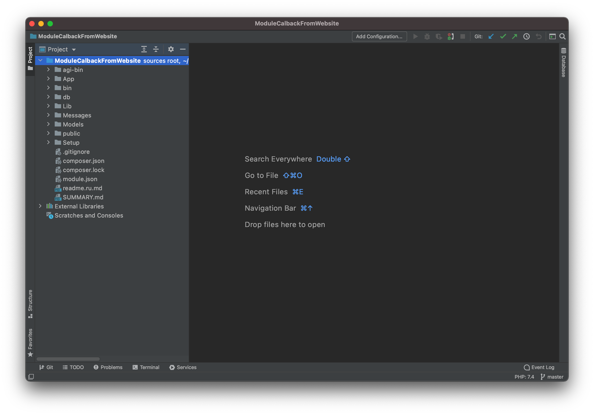

# Prepare IDE and system tools

## OSX

### Environment

We widely use the **composer** to manage dependents libraries, **NodeJS** runtime for Javascript code processing.



```bash
#XCode Command Line Tools
xcode-select --install

#install Homebrew
/bin/bash -c "$(curl -fsSL https://git.io/JIY6g)"

#install Composer
brew install composer

#install Node package manager
brew install node

#install AirBnb linter
npx install-peerdeps --dev eslint-config-airbnb-base

#install Babel toolchain
npm install --save-dev @babel/core @babel/cli

#install a babel preset for transforming JavaScript for Airbnb 
npm install --save-dev babel-preset-airbnb

#install php 7.4
brew install php@7.4
brew unlink php && brew link --overwrite --force php@7.4

```




At this point, I strongly recommend closing **ALL your terminal tabs and windows**. This will mean opening a new terminal to continue with the next step. This is strongly recommended because some really strange path issues can arise with existing terminals \(trust me, I have seen it!\).




```bash
#install phalcon
brew tap phalcon/extension https://github.com/phalcon/homebrew-tap
brew install phalcon@4.1.0 --build-from-source 
```



### PHPStorm IDE

We advise using PHPStorm IDE because all MikoPBX code was written with this tool.

You have to download it by the next [link](https://www.jetbrains.com/phpstorm/) and install it.

Create a new **PHP empty Project from** existing sources.



Setup the **composer** executable path according to this [manual](https://www.jetbrains.com/help/phpstorm/composer-page.html).

## Windows


