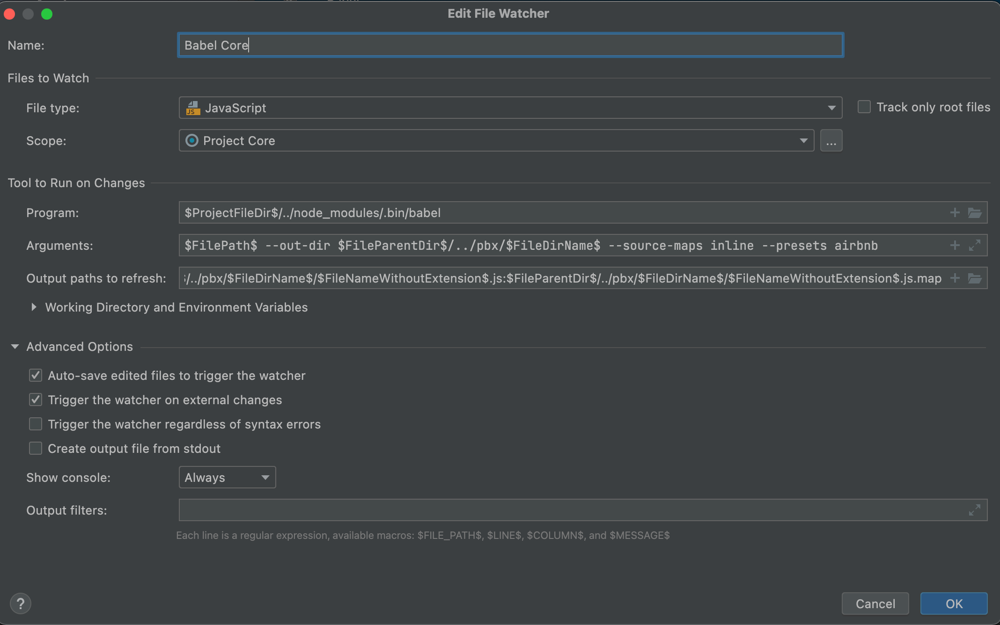

# Prepare IDE and system tools

## Example of organizing a working directory

```
MikoPBX
├── Core
│   ├── ...
│   └── ...
├── Extensions
│   ├── ModuleBackup
│   └── ModuleYourModule
└── node_modules
```

* **Core** - files from the repository [mikopbx/Core](https://github.com/mikopbx/Core)
* **Extensions** - directory for storing module files
* **ModuleBackup** - files from the repository[ mikopbx/ModuleBackup](https://github.com/mikopbx/ModuleBackup)
* **ModuleYourModule** - directory with files of your module
* **node\_modules** - node-js modules

## Environment


We widely use the **composer** to manage dependents libraries, **NodeJS** runtime for Javascript code processing.



```bash
# XCode Command Line Tools
xcode-select --install

# Install Homebrew
/bin/bash -c "$(curl -fsSL https://git.io/JIY6g)"

# Install Composer
brew install composer

# Install php 7.4
brew install php@7.4
brew unlink php && brew link --overwrite --force php@7.4
```

Install babel files to be able to convert JS files

```
// Create work dir 
mkdir -p ~/MikoPBX/Extensions;
cd ~/MikoPBX;

# Install Node package manager
brew install node

# Install AirBnb linter
npx install-peerdeps --dev eslint-config-airbnb-base

# Install Babel toolchain
npm install --save-dev @babel/core @babel/cli

# Install a babel preset for transforming JavaScript for Airbnb 
npm install --save-dev babel-preset-airbnb@^3.0.1
```



```
# Install PHP 7.4
# https://dev.to/amulya_shahi/how-to-download-install-php-7-4-6-manually-on-windows-10-4io0

# Install GIT
# Just go to https://git-scm.com/download/win and the download will start automatically. 

# Install composer
# Download and run https://getcomposer.org/Composer-Setup.exe

# Install xdebug PHP extension
# https://xdebug.org/docs/install#windows

# Install nodeJS
# Download and run https://nodejs.org/en/download/ 

# Create DIR for example H:/MikoPBXUtils, enter to it

# Install AirBnb linter
npx install-peerdeps --dev eslint-config-airbnb-base

# Install Babel toolchain
npm install --save-dev @babel/core @babel/cli

# Install a babel preset for transforming JavaScript for Airbnb 
npm install --save-dev babel-preset-airbnb@^3.0.1
```




At this point, I strongly recommend closing **ALL your terminal tabs and windows**. This will mean opening a new terminal to continue with the next step. This is strongly recommended because some really strange path issues can arise with existing terminals (trust me, I have seen it!).




```bash
#install phalcon
brew tap phalcon/extension https://github.com/phalcon/homebrew-tap
brew install phalcon@4.1.0 --build-from-source 
```



### Clone the Core MikoPBX repository

Use GIT command to make similar to picture folder sctructure with MikoPBX sources.

```
H:
├──MikoPBXTools
└──MikoPBX
    ├──Core <- Clone https://github.com/mikopbx/Core.git here
    └──Extensions
```

Install third party PHP libraries to MikoPBX/Core folder

```
cd MikoPBX/Core
composer install --ignore-platform-reqs 
```

### PHPStorm IDE

We advise using PHPStorm IDE because all MikoPBX code was written with this tool.

You have to download it by the next [link](https://www.jetbrains.com/phpstorm/) and install it.

Create a new **PHP empty Project from** existing sources.


Setup the **composer** executable path according to this [manual](https://www.jetbrains.com/help/phpstorm/composer-page.html).

Setup the **PHP** interpreter path according to this [manual](https://www.jetbrains.com/help/phpstorm/configuring-local-interpreter.html).

### PHPStorm: setup Babel

Babel is a toolchain that is mainly used to convert ECMAScript 2015+ code into a backwards compatible version of JavaScript in current and older browsers or environments.

Babel guarantees that the JS code will work the same in all web browsers.

The source JS files are located in directories:

* `MikoPBX/Core/sites/admin-cabinet/assets/js/src`&#x20;
* `MikoPBX/Extensions/*/public/assets/js/src`

Files that the web interface uses are located in directories:

* `MikoPBX/Core/sites/admin-cabinet/assets/js/src`
* `MikoPBX/Extensions/*/public/assets/js`

With any modification of the source file, babel must create a final file.

1. Go to  `Preferences / Tools / File Watchers`
2. Click to "**Add**" button
3. Choose template "**Babel**"
4. Set "**Name**" - Babel Core
5. Set "**Program**" `$ProjectFileDir$/../node_modules/.bin/babel`
6. Set "**Arguments**" `$FilePath$ --out-dir $FileParentDir$/../pbx/$FileDirName$ --source-maps inline --presets airbnb`&#x20;
7. Set "**Output path to refresh**": `$FileParentDir$/../pbx/$FileDirName$/$FileprNameWithoutExtension$.js:$FileParentDir$/../pbx/$FileDirName$/$FileNameWithoutExtension$.js.map`&#x20;
8. Set "**Auto-save edited files to trigger the watcher**"T
9. Set "**Trigger the watcher on external changes**"&#x20;
10. Setup "**Scope**", add all files from `MikoPBX/Core/sites/admin-cabinet/assets/js/src`



1. Go to  `Preferences / Tools / File Watchers`
2. Click to "**Add**" button
3. Choose template "**Babel**"
4. Set "**Name**" - Babel Modules
5. Set "**Program**" `$ProjectFileDir$/../node_modules/.bin/babel`
6. Set "**Arguments**" `$FilePath$ --out-dir $FileParentDir$ --source-maps --presets airbnb`&#x20;
7. Set "**Output path to refresh**": `$FileParentDir$/$FileNameWithoutExtension$.js:$FileParentDir$/$FileNameWithoutExtension$.js.map`&#x20;
8. Set "**Auto-save edited files to trigger the watcher**"T
9. Set "**Trigger the watcher on external changes**"&#x20;
10. Setup "**Scope**", add all files from `MikoPBX/Extensions/*/public/assets/js/src`
