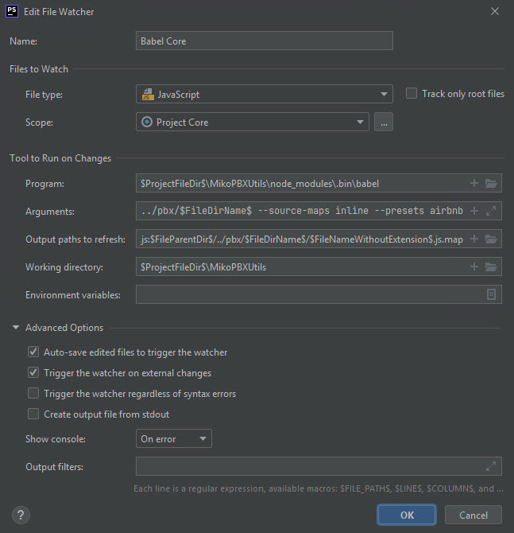
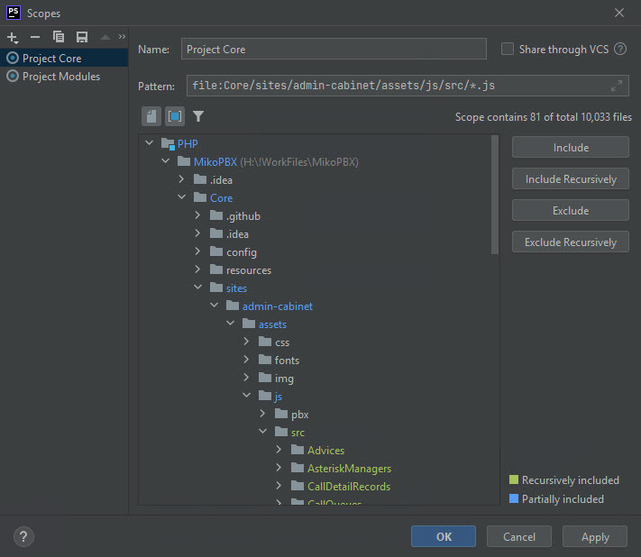
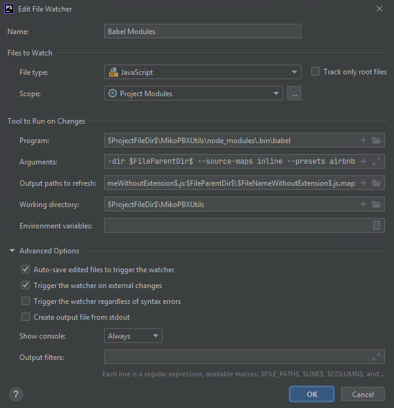
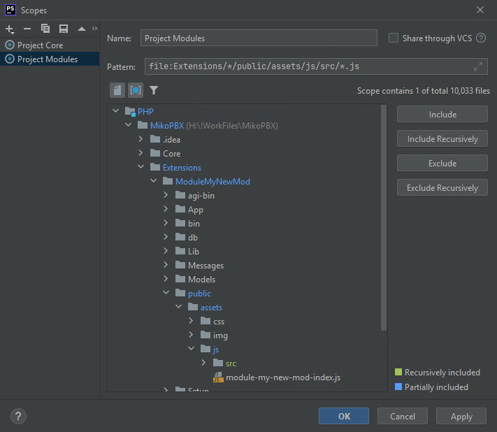
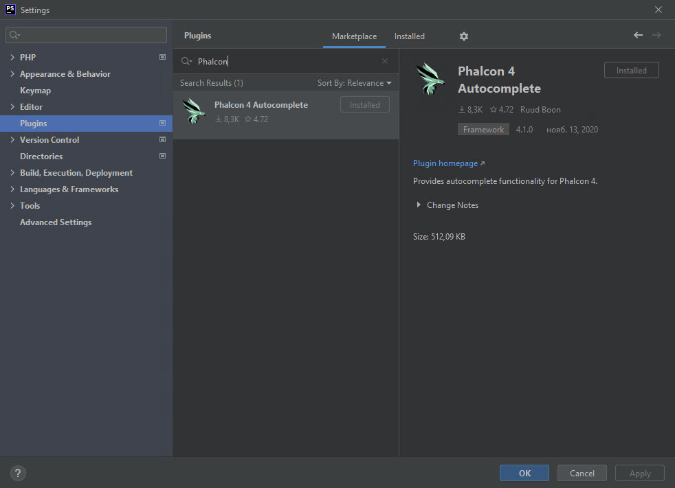

# Windows

## Example of organizing a working directory

```
MikoPBX
├── Core
│   ├── ...
│   └── ...
├── Extensions
│   ├── ModuleBackup
│   └── ModuleYourModule
└── MikoPBXUtils
    └──node_modules
```

* **Core** - files from the repository [mikopbx/Core](https://github.com/mikopbx/Core)
* **Extensions** - directory for storing module files
* **ModuleBackup** - files from the repository[ mikopbx/ModuleBackup](https://github.com/mikopbx/ModuleBackup)
* **ModuleYourModule** - directory with files of your module
* **MikoPBXUtils** - directory with external tools &#x20;
* **node\_modules** - node-js modules

## Environment

We widely use the **composer** to manage dependents libraries, **NodeJS** runtime for Javascript code processing.

```bash
# Install PHP 7.4
# https://dev.to/amulya_shahi/how-to-download-install-php-7-4-6-manually-on-windows-10-4io0

# Install GIT
# Just go to https://git-scm.com/download/win and the download will start automatically. 

# Install composer
# Download and run https://getcomposer.org/Composer-Setup.exe

# Install xdebug PHP extension
# https://xdebug.org/docs/install#windows

# Install nodeJS
# Download and run https://nodejs.org/en/download/ 

# Create DIR for example MikoPBX/MikoPBXUtils, enter to it
```

In MikoPBXUtils dir create file `babel.config.json`:


```json
{
  "presets": [["airbnb", {
    "targets": {
      "chrome": 50,
      "ie": 11,
      "firefox": 45
    }
  }]]
}
```


In MikoPBXUtils dir create file `package.json`:


```json
{
  "devDependencies": {
    "@babel/cli": "^7.14.3",
    "@babel/core": "^7.14.3",
    "@babel/polyfill": "^7.12.1",
    "@babel/preset-env": "^7.14.2",
    "babel-preset-airbnb": "^5.0.0",
    "eslint": "^7.27.0",
    "eslint-config-airbnb-base": "^14.2.1",
    "eslint-plugin-import": "^2.23.3"
  }
}
```


Install all from package.json file

```bash
npm install
```


At this point, I strongly recommend closing **ALL your terminal tabs and windows**. This will mean opening a new terminal to continue with the next step. This is strongly recommended because some really strange path issues can arise with existing terminals (trust me, I have seen it!).


### Clone the Core MikoPBX repository

Use GIT command to make similar to picture folder sctructure with MikoPBX sources.

```
MikoPBX
├── Core <- Clone https://github.com/mikopbx/Core.git here
├── Extensions
└── MikoPBXUtils
```

Install third party PHP libraries to MikoPBX/Core folder

```
cd MikoPBX/Core
composer install --ignore-platform-reqs 
```

### Create a new module structure

To create a new module for MikoPBX, you can use the [ModuleTemplate](https://github.com/mikopbx/ModuleTemplate) repository as ready for use template.

Every MikoPBX module must have a unique identifier, i.e. you are developing a call back module with the identifier – **ModuleYourModule**

```
MikoPBX
├── Core 
├── Extensions
│   └── ModuleYourModule
└── MikoPBXUtils
```

Сopy the script [`mod_replace.py`](https://github.com/mikopbx/ExtensionsDevTools/blob/master/mod\_replace.py) to the Extensions dir and run it. It clones the **ModuleTemplate** repository and renames folders, files, namespaces and class names according to the new module unique id – **ModuleYourModule.**

```
cd MikoPBX/Extensions
python mod_replace.py ModuleMyNewMod
```


The name of the new module must begin with 'Module'


### PHPStorm IDE

We advise using PHPStorm IDE because all MikoPBX code was written with this tool.

You have to download it by the next [link](https://www.jetbrains.com/phpstorm/) and install it.

Create a new **PHP empty Project from** existing sources.


Setup the **composer** executable path according to this [manual](https://www.jetbrains.com/help/phpstorm/composer-page.html).

Setup the **PHP** interpreter path according to this [manual](https://www.jetbrains.com/help/phpstorm/configuring-local-interpreter.html).

### PHPStorm: setup Babel

Babel is a toolchain that is mainly used to convert ECMAScript 2015+ code into a backwards compatible version of JavaScript in current and older browsers or environments.

Babel guarantees that the JS code will work the same in all web browsers.

The source JS files are located in directories:

* `MikoPBX/Core/sites/admin-cabinet/assets/js/src`&#x20;
* `MikoPBX/Extensions/*/public/assets/js/src`

Files that the web interface uses are located in directories:

* `MikoPBX/Core/sites/admin-cabinet/assets/js/pbx`
* `MikoPBX/Extensions/*/public/assets/js`

With any modification of the source file, babel must create a final file.

1. Go to  `Settings / Tools / File Watchers`
2. Click to "**Add**" button
3. Choose template "**Babel**"
4. Set "**Name**" - Babel Core
5. Set "**Program**" `$ProjectFileDir$\MikoPBXUtils\node_modules\.bin\babel`
6. Set "**Arguments**" `$FilePath$ --out-dir $FileParentDir$/../pbx/$FileDirName$ --source-maps inline --presets airbnb`&#x20;
7. Set "**Output path to refresh**": `$FileParentDir$/../pbx/$FileDirName$/$FileprNameWithoutExtension$.js:$FileParentDir$/../pbx/$FileDirName$/$FileNameWithoutExtension$.js.map`&#x20;
8. Set "**Auto-save edited files to trigger the watcher**"
9. Set "**Trigger the watcher on external changes**"&#x20;
10. Set "**Working directory**": `$ProjectFileDir$\MikoPBXUtils`
11. Setup "**Scope**"
12. Set "**Name**" **** - Project Core
13. Set "**Pattern**": `file:Core/sites/admin-cabinet/assets/js/src/*.js`





1. Go to  `Settings / Tools / File Watchers`
2. Click to "**Add**" button
3. Choose template "**Babel**"
4. Set "**Name**" - Babel Modules
5. Set "**Program**" `$ProjectFileDir$\MikoPBXUtils\node_modules\.bin\babel`
6. Set "**Arguments**" `$FilePath$ --out-dir $FileParentDir$ --source-maps inline --presets airbnb`&#x20;
7. Set "**Output path to refresh**": `$FileParentDir$\$FileNameWithoutExtension$.js:$FileParentDir$\$FileNameWithoutExtension$.js.map`&#x20;
8. Set "**Auto-save edited files to trigger the watcher**"
9. Set "**Trigger the watcher on external changes**"&#x20;
10. Set "**Working directory**": `$ProjectFileDir$\MikoPBXUtils`&#x20;
11. Setup "**Scope**"
12. Set "**Name**" **** - Project Modules
13. Set "**Pattern**":`file:Extensions/*/public/assets/js/src/*.js`





### PHPStorm: setup Phalcon Autocomplete

1. Go to  `Settings / Plugins`
2. Search "Phalcon" and install it&#x20;


